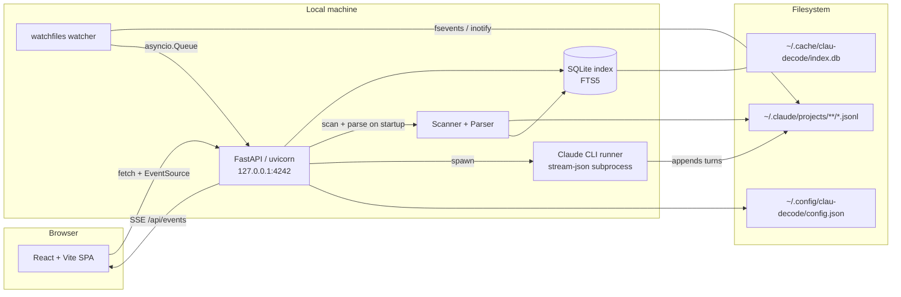

# Architecture

This document describes the internal architecture of `clau-decode`. It
complements [`README.md`](README.md) (user-facing) with the technical detail a
contributor or reviewer needs to navigate the code.

## Overview

Clau-Decode is a single-process, local-first application. A FastAPI server
(uvicorn, bound to `127.0.0.1:4242` by default) scans your AI coding
assistant's JSONL session files into a SQLite index, exposes them through a
JSON HTTP API plus a Server-Sent Events stream, and serves a pre-built React +
TypeScript SPA from the same origin. A `watchfiles`-based watcher detects
session-file changes in real time, and an optional headless runner spawns the
local Claude CLI as a subprocess (stream-json mode) so users can send messages
from the web UI. Nothing leaves the machine — there is no remote backend, no
telemetry, and no authentication layer.

## Component diagram

## Data flow: opening a session

1. User clicks a session in the sidebar.
2. The frontend router (`frontend/src/router.ts`) updates the URL hash to
   `#/chat/<session_id>` and `App.tsx` reacts to the route change.
3. `frontend/src/api/client.ts` issues `GET /api/sessions/<session_id>`.
4. The FastAPI route (`src/clau_decode/server.py`) calls `Database.get_session_detail`
   (`src/clau_decode/db.py`), which reads the session row and its messages
   from SQLite.
5. If the JSONL file's mtime has changed since the last index update, the
   server re-parses the file via `parse_session` (`src/clau_decode/parser.py`)
   and upserts the new messages back into SQLite before returning.
6. The route returns a `SessionDetail` JSON document; the React `ChatView`
   component renders markdown, tool-use, thinking, and sidechain blocks.
7. While the session is open, `/api/events` (SSE) pushes `{"type": "refresh"}`
   payloads whenever the watcher sees the underlying JSONL change. The
   frontend re-fetches and updates in place.

## Key directories

### Backend — `src/clau_decode/`

| Path | Role |
|------|------|
| `cli.py` | Argument parsing, subcommands (`dashboard`, `scan`, `today`, `stats`, `tips`), uvicorn launch |
| `server.py` | FastAPI app: HTTP routes, SSE stream, static SPA mount |
| `config.py` | XDG-aware config + DB path resolution, atomic config writes |
| `models.py` | Pydantic models (`AppConfig`, `Project`, `Session`, `Message`, `ContentBlock`, ...) |
| `scanner.py` | Walks `<root>/projects/*/` for JSONL session files |
| `parser.py` | Parses JSONL into `Session` + `list[Message]`; builds message trees |
| `db.py` | Async SQLite layer (`aiosqlite`) with FTS5 for search |
| `watcher.py` | `watchfiles.awatch` wrapper that emits `WatchEvent`s |
| `claude_runner.py` | Subprocess driver for the local CLI binary in stream-json mode |
| `editor.py` | Sandboxed file editing (used by `--enable-edit`) |
| `reporter.py` | JSON / Markdown export of conversations |
| `analytics/` | Token + cost engine, daily/weekly aggregators, tool/file/model stats, tip rules |
| `static/` | Pre-built SPA assets (committed in the wheel; rebuilt by `make frontend`) |

### Frontend — `frontend/src/`

| Path | Role |
|------|------|
| `main.tsx` | React entry point |
| `App.tsx` | Top-level layout, route-driven view selection, SSE wiring |
| `router.ts` | Hash-based routing (`/`, `/analytics`, `/chat/<id>`) |
| `api/` | Typed fetch client; `EventSource` helpers |
| `store/` | Zustand state stores (selection, UI flags, sidebar) |
| `components/Sidebar/` | Sidebar, search overlay, help, shortcuts |
| `components/ChatView/` | Conversation viewer, message blocks, runner panel |
| `components/Dashboard/` | Home dashboard (hero, heatmap, recap, projects) |
| `components/Analytics/` | Analytics panel and charts (ECharts) |
| `components/FileViewer/` | Split-pane file viewer + editor |
| `components/Settings/` | Settings modal |

## Storage

Clau-Decode follows the [XDG Base Directory
spec](https://specifications.freedesktop.org/basedir-spec/basedir-spec-latest.html):

| Purpose | Path (default) | Notes |
|---------|----------------|-------|
| User config | `~/.config/clau-decode/config.json` (or `$XDG_CONFIG_HOME/clau-decode/config.json`) | Atomic writes (`*.tmp` → rename) |
| Session index | `~/.cache/clau-decode/index.db` (or `$XDG_CACHE_HOME/clau-decode/index.db`) | SQLite + FTS5; safe to delete to force a full rescan |
| Scanned sessions | `~/.claude/projects/**/*.jsonl` (configurable) | Read-only by default; written only via the runner or `--enable-edit` |

No remote storage. No outbound network calls except optional pricing-table
refresh in the analytics module.

## Security model

- **Bind address.** Defaults to `127.0.0.1`. `--expose` (or `--host 0.0.0.0`)
  binds to all interfaces and prints a warning; intended for trusted networks
  only. There is no authentication.
- **File viewer.** Reads and (with `--enable-edit`) writes files. Access is
  sandboxed to session-related directories; path traversal and symlink escapes
  are explicitly defended against in `editor.py`. Binary and oversized writes
  are refused. A backup is written next to the original before any edit.
- **JSONL parsing.** Treated as untrusted input. Malformed lines are skipped
  with a warning; the parser never `eval`s and does not follow URLs.
- **Headless runner.** Spawns the local CLI binary on the user's behalf. The
  binary name is derived from the session's filesystem layout, not from
  user-supplied input; `shell=True` is never used.
- **No telemetry.** No analytics, no error reporting, no remote logging. The
  CI test suite asserts there are no outbound calls to remote services.

See [`SECURITY.md`](SECURITY.md) for the disclosure process and full scope.

## Performance notes

- **Incremental scan.** Each session row stores the source JSONL's mtime;
  files whose mtime is unchanged are skipped on rescan.
- **In-memory session-detail cache.** Hot sessions stay in a small LRU on the
  server so repeated fetches don't re-query SQLite.
- **FTS5 search.** Full-text search uses SQLite's FTS5 virtual table, which
  gives sub-millisecond query times across tens of thousands of messages.
- **Streaming SSE.** Live updates use a single long-lived `EventSource`
  connection per browser tab; payloads are tiny (`{"type": "refresh"}`).
- **Lazy frontend chunks.** Heavy components (ChatView, Analytics, Dashboard,
  FileViewer, SearchOverlay, SettingsModal) are `React.lazy`-loaded and
  pre-warmed in the background after first paint.
- **GZip middleware.** FastAPI compresses JSON responses over a few hundred
  bytes, which keeps session-detail payloads small on large conversations.
